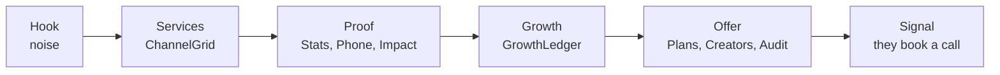

<h1 align="center">THE SIGNAL ROOM</h1>
<p align="center"><b>NexElite Media</b>. We turn noise into signal.</p>
<p align="center">Reels, campaigns, and brand content that people actually stop to watch. 40M+ views delivered across 60+ brands.</p>

<p align="center">
  
  
  
  
  
</p>

<p align="center">
  
</p>

---

### ON AIR

This is NexElite Media's own site. One page, read top to bottom as a single scroll journey, with the agency's case for itself built into the order of the sections rather than bolted on as copy.

The current theme is dark glass over a slow aurora field. No WebGL, no Three.js, no Framer Motion. Everything moves through GSAP, Lenis, and CSS, which is what keeps the page fast on the phones the audience actually uses.

The one-line pitch, straight from the site's own metadata: "We turn noise into signal. Reels, campaigns and brand content that people actually stop to watch. 40M+ views delivered across 60+ brands."

---

### THE SCROLL JOURNEY



`JourneyHUD` sits in the masthead as a labelled chapter rail, so the visitor always knows how far into the argument they are. `PaperGround` draws the aurora field and the faint column grid every stage aligns to. It keeps its old name because every import points at it.

---

### THE COMPONENTS

| Component | What it does |
|---|---|
| `PaperGround` | fixed aurora field plus the 12 column grid the layout sits on |
| `JourneyHUD` | labelled chapter rail in the masthead, doubles as scroll progress |
| `ChannelGrid` | the eight service lines, rendered from `lib/services.ts` |
| `ServicePanel` | expanded detail for a single service line |
| `Upgrade` | the conversion block: offer bar, plans, creator network, brand audit |
| `StatsProof` / `PhoneProof` | the headline numbers, and what the work looks like in feed |
| `ClientImpact` | real client outcomes, sourced from `lib/impact.ts` |
| `GrowthLedger` | creator growth stories with before and after numbers |
| `CutCadence` | the editing rhythm, shown rather than described |
| `BrandMarquee` | the client logo band |
| `WorkTeasers` | case study teasers that link into `/work/[slug]` |
| `SignalRings` | the ambient ring motion behind the hook |
| `StickyCTA` | the persistent booking prompt |

The brand audit inside `Upgrade` scores from questions the visitor answers. It does not pretend to crawl anything, because a fake crawl is the fastest way to lose a lead who knows better.

---

### EIGHT CHANNELS, ONE STATION

| Channel | What it delivers | Headline number |
|---|---|---|
| **Creators plan** | Content system for individual creators, consistent output, a growth plan | 3.2x avg. follower growth / 90 days |
| **D2C** | Full-funnel content built to convert traffic into orders | 2.8x avg. ROAS on paid creative |
| **Extra's** | One-off shoots, quick-turn edits, thumbnail packs | 48hr avg. turnaround |
| **Influencer marketing** | Creator sourcing, briefing, and campaign management end to end | 6M+ campaign reach delivered |
| **Local business** | Local SEO-aware content and Google Business presence | 35% avg. lift in local search views |
| **Performance marketing** | Paid media across Meta, Google, TikTok, tracked against CPA and ROAS | 3.1x avg. ROAS across accounts |
| **Social media marketing** | Full social management, calendars, community, reporting | 2.4x avg. engagement growth |
| **Website plans** | Sites built to match the brand's actual visual identity | 1.8s avg. load time |

Service copy and KPIs live in `lib/services.ts`, not in the components, so a number is changed in exactly one place.

---

### CONTROL ROOM

```
app/
├── layout.tsx        # fonts, metadata, JSON-LD
├── page.tsx           # the whole journey, composed
├── globals.css        # the entire theme: tokens, glass system, aurora
├── icon.png / apple-icon.png
├── robots.ts / sitemap.ts
└── work/[slug]/        # case study routes

components/
├── PaperGround.tsx     JourneyHUD.tsx      SignalRings.tsx
├── ChannelGrid.tsx     ServicePanel.tsx    Upgrade.tsx
├── StatsProof.tsx      PhoneProof.tsx      ClientImpact.tsx
├── GrowthLedger.tsx    CutCadence.tsx      BrandMarquee.tsx
└── WorkTeasers.tsx     StickyCTA.tsx

lib/
├── site.ts             # SITE_URL, title, description, JSON-LD
├── services.ts          # the 8 channel catalog with real KPIs
├── impact.ts            # client outcomes and creator growth data
├── work.ts              # case studies behind /work/[slug]
├── journey.ts           # chapter definitions for JourneyHUD
├── scroll.ts / motion.ts / frame.ts
└── useReducedMotion.ts  # respects prefers-reduced-motion

scripts/
└── check-bundle.mjs     # part of `npm run verify`
```

Two files carry the weight. `lib/site.ts` is deliberately the one place `SITE_URL`, title, and description live, so changing the domain moves metadata, canonical URLs, Open Graph, and the sitemap together. `app/globals.css` holds every colour token, so a full theme swap touches one file.

---

### ON THE DIAL

- **Framework:** Next.js 16, React 19
- **Motion:** GSAP, Lenis smooth scroll, CSS glass surfaces
- **Type-safety:** TypeScript, strict
- **Styling:** Tailwind CSS v4
- **Icons:** Lucide React

---

### BROADCASTING LOCALLY

```bash
git clone https://github.com/sbktckp/NexElite.git
cd NexElite
npm install
npm run dev
```

Before shipping anything, run the full check:

```bash
npm run verify
```

That runs type checking, lint, a full production build, and a bundle-size check in one gate. It is the same command CI expects to pass clean.

---

<p align="center">NexElite Media, Creative Media Agency</p>
