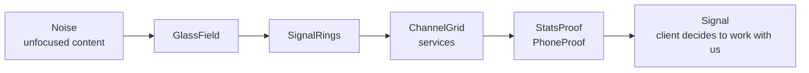

<h1 align="center">THE SIGNAL ROOM</h1>
<p align="center"><b>NexElite Media</b>. We turn noise into signal.</p>
<p align="center">Reels, campaigns, and brand content that people actually stop to watch. 40M+ views delivered across 60+ brands.</p>

<p align="center">
  
  
  
  
  
</p>

<p align="center">
  
</p>

---

### ON AIR

This is NexElite Media's own site, a Next.js build that opens on a broadcast-monitor concept: signal in, signal out. Everything on the page, from the glass surfaces to the ring animations to the channel grid of services, is built around one idea. Turn noise into signal, literally rendered as motion.

The one-line pitch, straight from the site's own metadata: "We turn noise into signal. Reels, campaigns and brand content that people actually stop to watch. 40M+ views delivered across 60+ brands."

---

### THE BROADCAST CHAIN



Six components carry the concept end to end. `GlassField` lays down the field of light every surface refracts, and `SignalRings` does the rest of the visual lifting. `ChannelGrid` lays out the eight service lines, and `StatsProof` and `PhoneProof` are where the signal becomes a number you can trust.

---

### EIGHT CHANNELS, ONE STATION

The full service catalog, as it actually ships on the site:

| Channel | What it delivers | Headline number |
|---|---|---|
| **Creators plan** | Content system for individual creators, consistent output, a growth plan | 3.2x avg. follower growth / 90 days |
| **D2C** | Full-funnel content built to convert traffic into orders | 2.8x avg. ROAS on paid creative |
| **Extra's** | One-off shoots, quick-turn edits, thumbnail packs | 48hr avg. turnaround |
| **Influencer marketing** | Creator sourcing, briefing, and campaign management end to end | 6M+ campaign reach delivered |
| **Local business** | Local SEO-aware content and Google Business presence | 35% avg. lift in local search views |
| **Performance marketing** | Paid media across Meta, Google, TikTok, tracked against CPA and ROAS | 3.1x avg. ROAS across accounts |
| **Social media marketing** | Full social management, calendars, community, reporting | 2.4x avg. engagement growth |
| **Website plans** | Sites built to match the brand's actual visual identity | 1.8s avg. load time |

---

### CONTROL ROOM

```
app/
├── layout.tsx        # fonts (Bricolage Grotesque, Inter, Space Mono), metadata, JSON-LD
├── page.tsx           # the main broadcast, 21KB of composed sections
├── globals.css
├── robots.ts / sitemap.ts
└── work/               # case-study routes, in progress

components/
├── GlassField.tsx      # the field of light behind every glass surface
├── SignalRings.tsx
├── ChannelGrid.tsx      # renders the 8-service catalog
├── JourneyHUD.tsx
├── ServicePanel.tsx
├── StatsProof.tsx
├── PhoneProof.tsx
├── WorkTeasers.tsx
└── StickyCTA.tsx

lib/
├── site.ts             # SITE constants, title, description, JSON-LD, single source of truth
├── services.ts          # the 8-channel catalog, with real KPIs per service
├── work.ts
├── frame.ts
└── motion.ts / useReducedMotion.ts   # respects prefers-reduced-motion

scripts/
└── check-bundle.mjs     # part of `npm run verify`
```

`lib/site.ts` is deliberately the one place `SITE_URL`, title, and description live. Change the domain there and metadata, canonical URLs, Open Graph, and the sitemap all move together. Get it wrong before launch and every one of those breaks silently.

---

### ON THE DIAL

- **Framework:** Next.js 16, React 19
- **Motion:** GSAP, Lenis (smooth scroll), CSS glass surfaces
- **Type-safety:** TypeScript, strict
- **Styling:** Tailwind CSS v4
- **Icons:** Lucide React

---

### BROADCASTING LOCALLY

```bash
git clone https://github.com/sbktckp/NexElite.git
cd NexElite
npm install
npm run dev
```

Before shipping anything, run the full check:

```bash
npm run verify   # tsc --noEmit && eslint . && next build && node scripts/check-bundle.mjs
```

This is the same command CI expects to pass clean: type errors, lint, a full production build, and a bundle-size check, all in one gate.

---

<p align="center">NexElite Media, Creative Media Agency</p>
